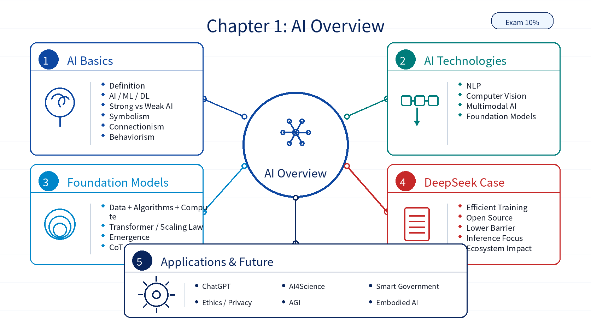

# Chapter 01: AI Overview

## 1. Overall Framework

`AI Overview` is the conceptual entry point of HCIA-AI V4.0. It maps to the `AI Overview` exam area with a 10% weight. The chapter establishes shared vocabulary for later topics: what AI is, how AI relates to machine learning and deep learning, what major AI technologies exist, why foundation models matter, and how AI applications raise social and governance questions.

| Module | Role |
|---|---|
| AI Description | AI definition, intelligence, strong AI, weak AI, and major AI schools |
| AI Technologies | NLP, computer vision, multimodal AI, and foundation models |
| DeepSeek and AI Development | DeepSeek as a case for efficient model development and open-source impact |
| AI Applications | ChatGPT-like applications, industry use cases, AI4Science, and public-sector scenarios |
| Debates and Future | Ethics, privacy, copyright, employment, AGI, and embodied AI |

## 2. Key Points

| Key Point | Description |
|---|---|
| AI/ML/DL hierarchy | AI is the broad research field; machine learning is a major implementation path; deep learning is a neural-network-based branch of machine learning |
| AI schools | Symbolism, connectionism, and behaviorism represent rule-based reasoning, neural networks, and environment-driven behavior |
| AI foundations | Data, algorithms, and computing power form the base of modern AI systems |
| Foundation models | Large-scale models trained on broad data with strong generalization and transfer capabilities |
| DeepSeek case | A current example of efficient model development, open-source influence, lower usage barriers, and ecosystem impact |
| AI governance | Covers authenticity, privacy, security, copyright, employment, and responsible use |

## 3. Difficult Points

| Difficult Point | Why It Matters | Suggested Reading Angle |
|---|---|---|
| AI vs ML vs DL vs foundation models | These terms are often mixed together | Read them as nested concepts and attach one example to each layer |
| AI schools | They are historical and abstract | Compare them through three keywords: symbols, neurons, and feedback |
| Foundation model concepts | They involve data scale, compute, Transformer, emergence, and prompting | Start with the model lifecycle before reading architecture details |
| DeepSeek case | It combines technology, open source, cost, and ecosystem effects | Treat it as a case study rather than a list of isolated facts |
| Governance topics | They may look non-technical | Connect each risk to a control measure, such as review, privacy protection, or policy |

## 4. Learning Notes

1. Start with the AI/ML/DL/foundation model hierarchy.
2. Use `Data + Algorithms + Computing Power` as a recurring mental model.
3. Read DeepSeek as an example of current foundation model development trends.
4. Keep application and governance topics connected to real AI system usage.

## 5. Chapter Summary Image

