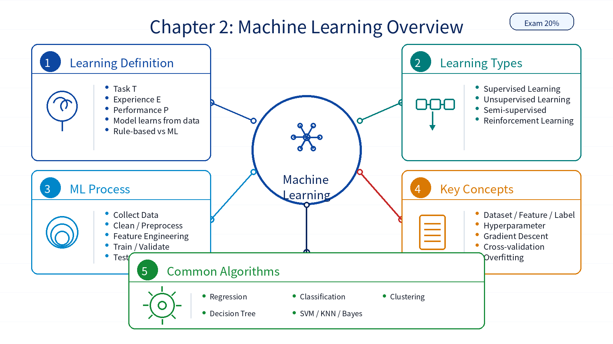

# Chapter 02: Machine Learning Overview

## 1. Overall Framework

`Machine Learning Overview` moves from AI concepts to algorithmic methods. It maps to a 20% exam weight. The chapter explains how machines learn from experience, how learning tasks are categorized, what a typical machine learning workflow looks like, and which algorithms are commonly used.

| Module | Role |
|---|---|
| Machine Learning Algorithms | Defines task T, experience E, and performance P |
| Types of Machine Learning | Supervised, unsupervised, semi-supervised, and reinforcement learning |
| Machine Learning Process | Data preparation, model fitting, validation, testing, and deployment |
| Important Concepts | Dataset, feature, label, hyperparameter, gradient descent, cross-validation, and evaluation |
| Common Algorithms | Regression, classification, clustering, decision tree, SVM, KNN, Naive Bayes, and related methods |

## 2. Key Points

| Key Point | Description |
|---|---|
| Learning definition | A program improves performance P on task T through experience E |
| Rule-based methods vs ML | Rule-based systems use explicit rules; ML learns rules from examples |
| Task types | Classification outputs discrete classes, regression outputs continuous values, clustering groups unlabeled data |
| Learning categories | The label availability and feedback mechanism determine the learning category |
| Workflow | Data collection, cleaning, feature work, model fitting, evaluation, tuning, and deployment |
| Gradient descent | Iteratively updates parameters by following the loss gradient |
| Evaluation metrics | Regression and classification require different evaluation methods |

## 3. Difficult Points

| Difficult Point | Why It Matters | Suggested Reading Angle |
|---|---|---|
| Task T / Experience E / Performance P | The definition is abstract | Map it to handwriting recognition: task, labeled samples, and accuracy |
| Classification vs regression vs clustering | They all look like prediction or grouping tasks | Compare the output type and whether labels exist |
| Overfitting and underfitting | Generalization is not visible from one dataset alone | Compare performance on fitting data and held-out data |
| Gradient descent | It combines loss, parameters, direction, and learning rate | Connect it to the linear regression expansion experiment |
| Metric selection | Different tasks require different metrics | Build a table by task type |

## 4. Learning Notes

1. Link this chapter to the five machine learning lab scripts.
2. For each algorithm, identify the input, output, task type, and verification method.
3. Keep gradient descent as the bridge to later deep learning content.
4. Prioritize definitions, learning categories, workflows, task types, and algorithm use cases.

## 5. Chapter Summary Image

