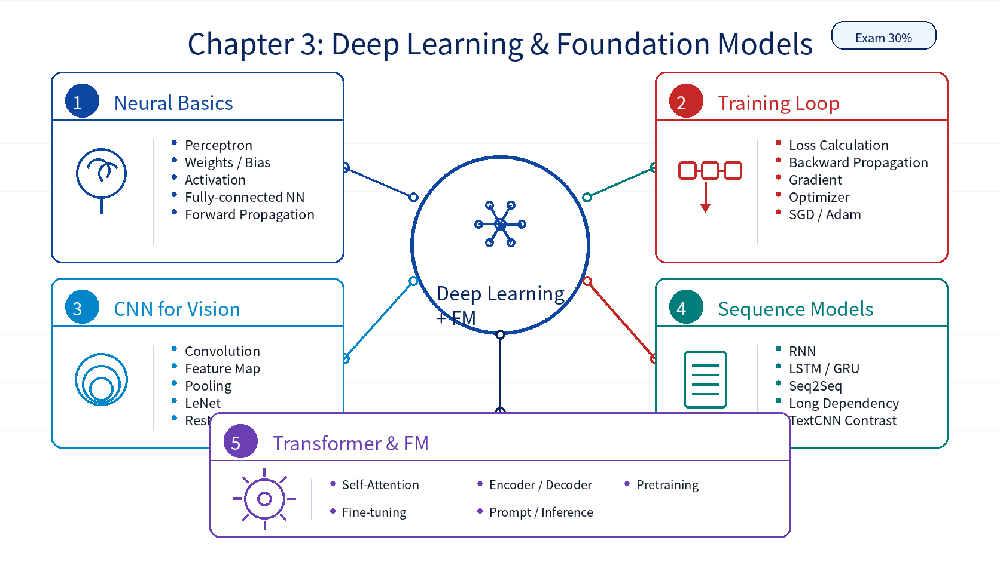

# Chapter 03: Basics of Deep Learning and Foundation Models

## 1. Overall Framework

`Basics of Deep Learning and Foundation Models` is the most technical chapter, with a 30% exam weight. It starts from the perceptron and fully connected neural networks, then moves to CNN, RNN, Transformer, and foundation model architecture.

| Module | Role |
|---|---|
| Perceptron | Introduces neurons, weights, bias, and activation functions |
| Fully Connected Neural Network | Explains forward propagation, loss, backpropagation, gradients, and optimizers |
| Convolutional Neural Network | Introduces convolution, pooling, feature maps, and image classification models |
| Recurrent Neural Network | Introduces sequence modeling, RNN, LSTM, GRU, and related architectures |
| Transformer Architecture | Explains self-attention, encoder/decoder structures, and sequence modeling improvements |
| Foundation Model Architecture | Covers pretraining, fine-tuning, prompting, inference, and large-scale infrastructure concepts |

## 2. Key Points

| Key Point | Description |
|---|---|
| Neural network workflow | Input data, forward pass, loss calculation, backward pass, parameter update |
| Activation functions | Add nonlinearity and allow networks to represent complex relationships |
| Backpropagation | Computes gradients through the chain rule |
| CNN | Uses local connections, weight sharing, and pooling to extract image features |
| RNN | Processes sequential data but can struggle with long-range dependencies |
| Transformer | Uses self-attention to model relationships across sequence positions |
| Foundation models | Use large-scale pretraining and are adapted through prompting, fine-tuning, or retrieval-based methods |

## 3. Difficult Points

| Difficult Point | Why It Matters | Suggested Reading Angle |
|---|---|---|
| Forward vs backward pass | Data and gradient flow in opposite directions | Read it as prediction forward, error signal backward |
| Loss vs optimizer | One measures the error, the other updates parameters | Compare SGD, Momentum, AdaGrad, and Adam loss curves |
| CNN dimensions | Kernel size, padding, stride, and feature maps interact | Track shape changes layer by layer |
| RNN vs Transformer | Both handle sequences but use different mechanisms | Compare step-by-step recurrence with global attention |
| Foundation model infrastructure | It spans data, model size, compute, serving, and application patterns | Organize it as data, model, training, inference, and application |

## 4. Learning Notes

1. Give this chapter the most attention because of its 30% weight.
2. Use the fully connected neural network experiment to understand the training loop.
3. Use LeNet and ResNet-50 to connect CNN concepts to image classification.
4. Use TextCNN and LLM deployment to connect sequence modeling and foundation model usage.

## 5. Chapter Summary Image

