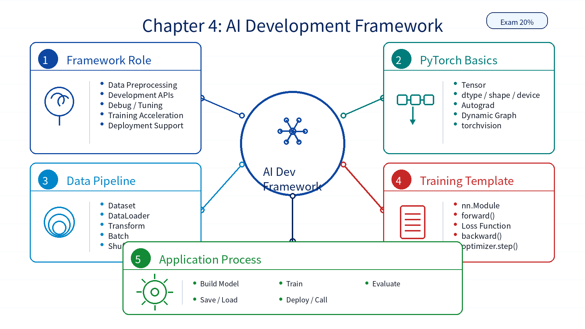

# Chapter 04: AI Development Framework

## 1. Overall Framework

`AI Development Framework` has a 20% exam weight. It explains why AI frameworks are needed, what capabilities they provide, how PyTorch organizes model development, and how an AI application moves from data to deployment.

| Module | Role |
|---|---|
| AI Framework | Data preprocessing, model APIs, debugging, tuning, acceleration, and deployment support |
| Mainstream Frameworks | PyTorch, TensorFlow, and related ecosystem tools |
| Framework Basics | Tensor, Dataset, Model, Optimizer, Loss, and device management |
| PyTorch | Tensor operations, dynamic graphs, `nn.Module`, `DataLoader`, and `torchvision` |
| AI Application Development Process | Data preparation, model building, fitting, evaluation, saving, deployment, and calling |

## 2. Key Points

| Key Point | Description |
|---|---|
| Framework value | Reduces complexity in data processing, model definition, fitting, debugging, and deployment |
| Tensor | Core data structure that supports device-aware computation |
| Dataset/DataLoader | Provides data reading, batching, shuffling, and parallel loading |
| `nn.Module` | Base abstraction for defining PyTorch models |
| Loss + Optimizer | The loss measures error; the optimizer updates parameters |
| Save/Load | Enables reuse, checkpointing, and deployment |
| Application workflow | Connects data, model, evaluation, and service usage |

## 3. Difficult Points

| Difficult Point | Why It Matters | Suggested Reading Angle |
|---|---|---|
| Tensor vs NumPy array | They look similar but differ in device and gradient support | Compare `dtype`, `device`, and autograd behavior |
| Dataset/DataLoader abstraction | It hides many data pipeline details | Follow one batch through the training loop |
| `Module` and `forward()` | Calling `net(x)` executes `forward()` | Print layer outputs in a small model such as LeNet |
| Device placement | Model and tensors must be on the same device | Check every `.to(device)` call |
| Training loop order | Missing one step breaks learning | Use the template: zero grad, forward, loss, backward, step |

## 4. Learning Notes

1. Read the PyTorch experiments in order: Tensor basics, Dataset loading, LeNet, ResNet-50, and TextCNN.
2. Focus on where each API fits inside the model development loop.
3. Keep device management and data batching visible while reading the code.
4. Treat the training loop as a reusable implementation pattern.

## 5. Chapter Summary Image

