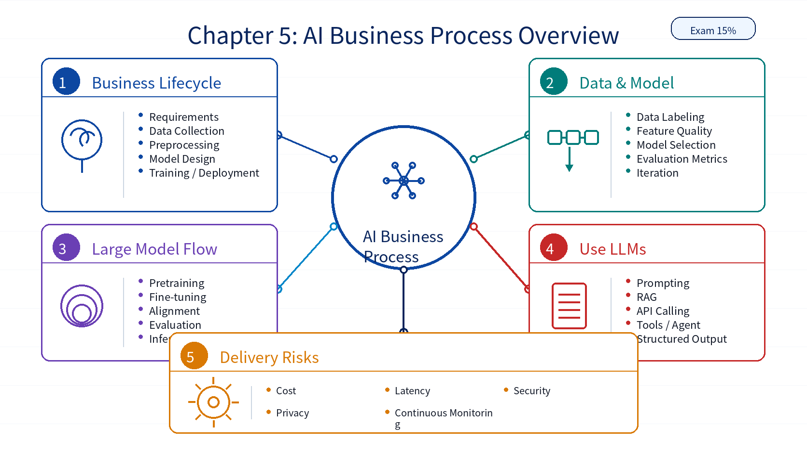

# Chapter 05: AI Business Process Overview

## 1. Overall Framework

`AI Business Process Overview` has a 15% exam weight. It describes how AI work moves from business requirements to data preparation, model design, fitting, deployment, monitoring, and improvement. It also covers large model workflows and prompt engineering.

| Module | Role |
|---|---|
| AI Business Process | Requirements, data collection, preprocessing, model design, model fitting, deployment, and iteration |
| Data and Model Work | Data labeling, data quality, feature quality, model choice, and evaluation |
| Large Model Business Process | Pretraining, fine-tuning, alignment, evaluation, and inference service |
| Use of Large Models | Prompting, RAG, API calling, tool usage, agents, and structured output |
| Delivery Risks | Cost, latency, security, privacy, monitoring, and operational constraints |

## 2. Key Points

| Key Point | Description |
|---|---|
| End-to-end workflow | AI projects start from requirements and end with deployed, monitored systems |
| Data work | Collection, labeling, cleaning, and preprocessing strongly affect quality |
| Model selection | Depends on task type, data scale, resource limits, and expected metrics |
| Large model lifecycle | Includes pretraining, fine-tuning, alignment, evaluation, and serving |
| Prompt engineering | Uses role, task, context, constraints, examples, and output format to improve responses |
| Application patterns | API calls, RAG, agents, tools, and domain knowledge integration |

## 3. Difficult Points

| Difficult Point | Why It Matters | Suggested Reading Angle |
|---|---|---|
| Business flow vs technical flow | Model code is only one part of the work | Read the process from requirement to deployment |
| Data quality | Poor data directly limits model quality | Track how data issues affect model outputs |
| Training vs fine-tuning vs prompting | They require different resources and goals | Compare when each method is appropriate |
| Prompt engineering | It looks like natural language but needs structure | Use role, task, context, constraints, examples, and output format |
| Evaluation and deployment | They define whether the solution is usable | Include cost, latency, safety, and monitoring |

## 4. Learning Notes

1. Read this chapter as an end-to-end workflow rather than as isolated steps.
2. Separate foundation model pretraining, fine-tuning, prompting, RAG, and API calling.
3. Connect this chapter to the LLaMA.cpp CLI and web API experiments.
4. Use metrics, cost, latency, and safety as the practical checkpoints.

## 5. Chapter Summary Image

