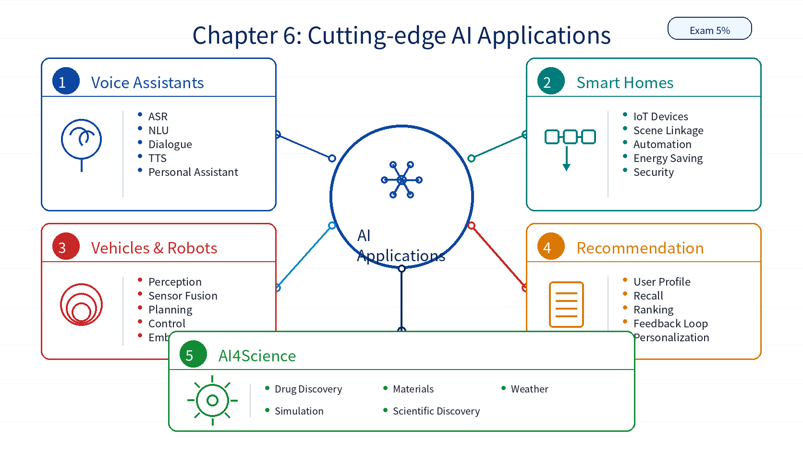

# Chapter 06: Cutting-edge AI Applications

## 1. Overall Framework

`Cutting-edge AI Applications` has a 5% exam weight. It focuses on how AI is applied in representative scenarios: voice assistants, smart homes, intelligent vehicles, recommendation systems, robots, and AI4Science. The emphasis is on recognizing application patterns rather than deriving algorithms.

| Module | Role |
|---|---|
| Voice Assistants | Speech recognition, language understanding, dialogue, and speech generation |
| Smart Homes | IoT devices, automation, scene linkage, energy saving, and security |
| Intelligent Vehicles | Perception, sensor fusion, planning, control, and safety |
| Intelligent Recommendation | User profiles, recall, ranking, feedback loops, and personalization |
| Intelligent Robots | Perception, planning, control, execution, and embodied AI |
| AI4Science | Drug discovery, materials, weather, simulation, and scientific discovery |

## 2. Key Points

| Key Point | Description |
|---|---|
| Scenario recognition | Identify what problem AI solves in each scenario |
| Technology combinations | Real applications often combine perception, understanding, decision-making, and action |
| Voice assistant pipeline | ASR, NLU, dialogue, and TTS form a common interaction chain |
| Intelligent vehicle pipeline | Perception, fusion, planning, and control are core modules |
| Recommendation systems | Usually include user modeling, candidate recall, ranking, and feedback optimization |
| AI4Science | Uses AI to accelerate scientific modeling, prediction, and discovery |

## 3. Difficult Points

| Difficult Point | Why It Matters | Suggested Reading Angle |
|---|---|---|
| Many application examples | They can look like disconnected cases | Use one common pattern: input data, AI capability, output value |
| Mixed technologies | One application can combine CV, NLP, ML, and deep learning | Split each system into perception, understanding, decision, and action |
| Intelligent vehicles | They involve hardware, real-time constraints, safety, and regulation | Focus on perception, planning, and control |
| AI4Science | It may be unfamiliar without science domain context | Use drug discovery, materials, and weather as anchors |
| Low weight but broad scope | The content is wide but not deeply algorithmic | Focus on scenario keywords and value creation |

## 4. Learning Notes

1. Use this chapter to connect previous technologies to real-world scenarios.
2. Do not over-focus on algorithm derivations here.
3. For each application, identify the data, model capability, and output value.
4. Treat AI4Science as the representative frontier case for scientific discovery.

## 5. Chapter Summary Image

